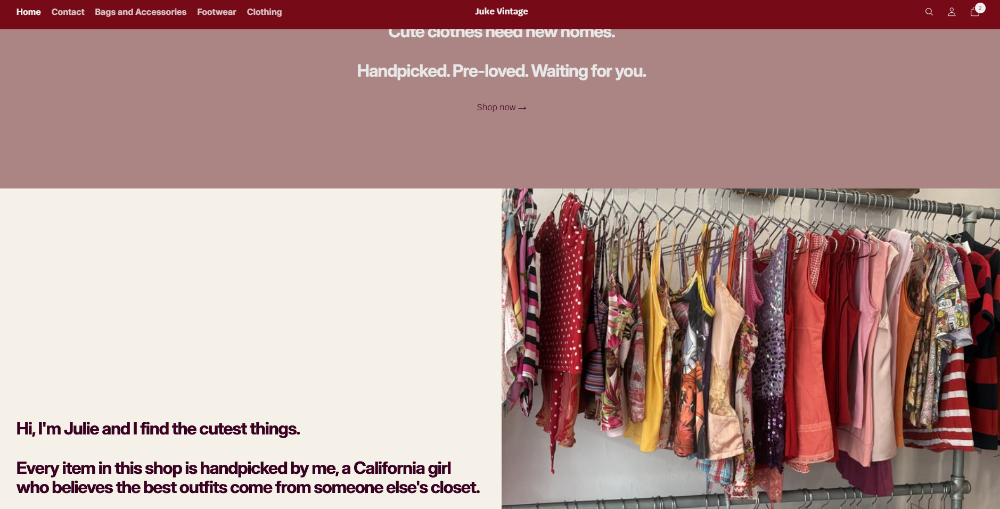
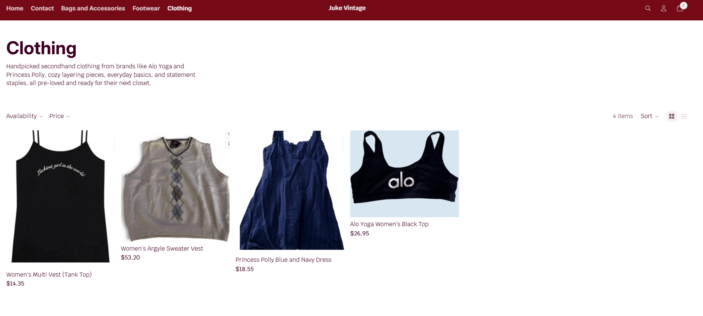
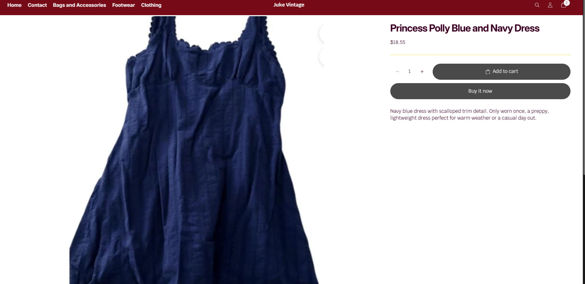
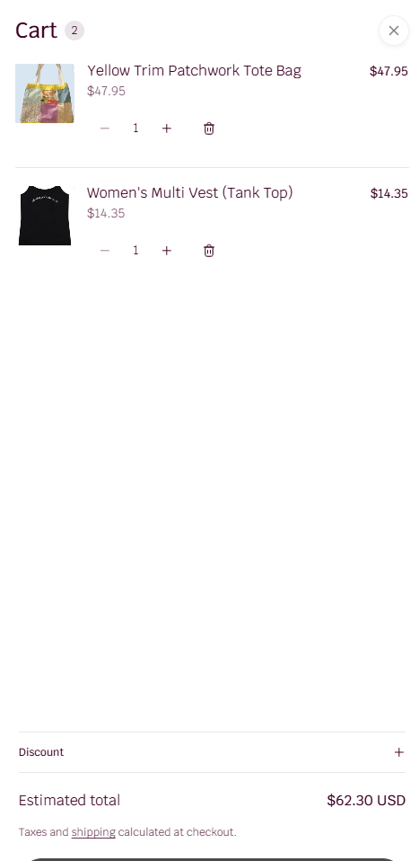
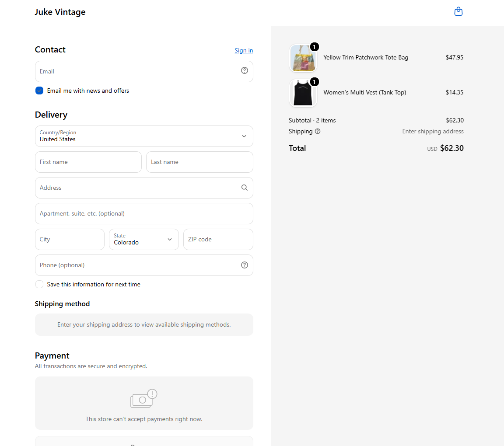
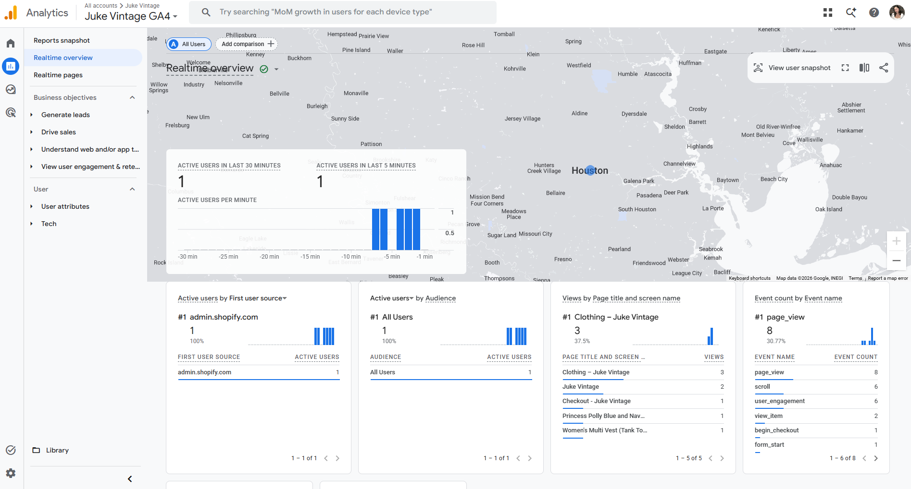

## Introduction

For this assignment, I tested the Juke Vintage customer journey from the homepage all the way through to checkout, without processing a real transaction. I also pulled a Google Analytics 4 real-time report to confirm the journey was being tracked as a customer would actually move through it. This report walks through each stage, what I found, and what I still want to improve before the final submission.

## Customer Journey Test

### Homepage

The homepage opens with a hero banner ("Cute clothes need new homes. Handpicked. Pre-loved. Waiting for you.") followed by a personal introduction section with my name and a short brand story, next to a photo of the actual clothing rack.

### Collection Page

From the main navigation, I clicked into the Clothing collection to see the product grid, filtering options, and category description.

### Product Page

I clicked into the Princess Polly Blue and Navy Dress to view the full product page, including price, description, and the add to cart and buy it now options.

### Cart

After adding the dress and a second item (a Women's Multi Vest) to the cart, I opened the cart to confirm quantities, pricing, and the estimated total.

### Checkout Preview

From the cart, I proceeded to checkout to view the contact, delivery, and payment sections. I did not enter real payment information or complete the purchase, consistent with the assignment instructions.

## Store Strengths

1. **Clear, personal brand voice.** The homepage introduces me by name and explains the handpicked, secondhand concept right away, which helps a first time visitor understand what makes the store different from a typical retailer.
2. **Simple, organized navigation.** The four category links (Bags and Accessories, Footwear, Clothing, Contact) make it easy to jump straight to what a customer is looking for without extra clicks.
3. **Clear product page structure.** Each product page shows price, a written condition description, and both an add to cart and a buy it now button, making the path to purchase short and easy to follow.

## Areas for Improvement

1. **Product photo consistency.** Some product photos, like the dress, are cropped tightly or zoomed in a way that cuts off the full garment. More consistent, full length photos across listings would help customers judge fit and condition more easily.
2. **Missing measurements on product pages.** My policies state that I include measurements and condition notes on every listing, but the product page I tested only included a general description, not specific measurements. I want to make sure every listing actually matches what my policy promises.
3. **No visible email capture on the homepage.** The homepage introduces the brand well but does not offer a way to join an email list or follow for updates, which was listed as a backup action in my design brief but is not yet present on the live site.

## Analytics Review

I reviewed my GA4 Realtime overview after completing the customer journey test above.

The report confirms that my testing activity was tracked end to end. The event count by event name shows 8 page_view events, 6 scroll events, 6 user_engagement events, 2 view_item events, 1 begin_checkout event, and 1 form_start event, which lines up directly with the pages I clicked through: the Clothing collection, the product page, and the checkout screen. The views by page title report also lists "Clothing - Juke Vintage," "Checkout - Juke Vintage," and "Princess Polly Blue and Navy Dress" by name, confirming GA4 is capturing which specific pages and products a visitor interacts with, not just overall traffic.

## Improvement Plan

Before my final submission, I plan to focus on closing the gap between what my policies promise and what actually appears on the live product pages, starting with adding real measurements to each listing so they match my stated return and refund policy. I also want to standardize my product photography so every item shows a consistent, full length view rather than a mix of cropped and zoomed shots, since this came up clearly while testing the customer journey. Finally, I want to add a simple email signup section to the homepage so visitors who are not ready to buy yet still have a way to stay connected to the shop, which supports the backup action I originally planned for in my design brief.

## Appendix

**GitHub Pages:** [https://jukedz.github.io/assignment8-store-testing/](https://jukedz.github.io/assignment8-store-testing/)

**GitHub Repository:** [https://github.com/jukedz/assignment8-store-testing](https://github.com/jukedz/assignment8-store-testing)
