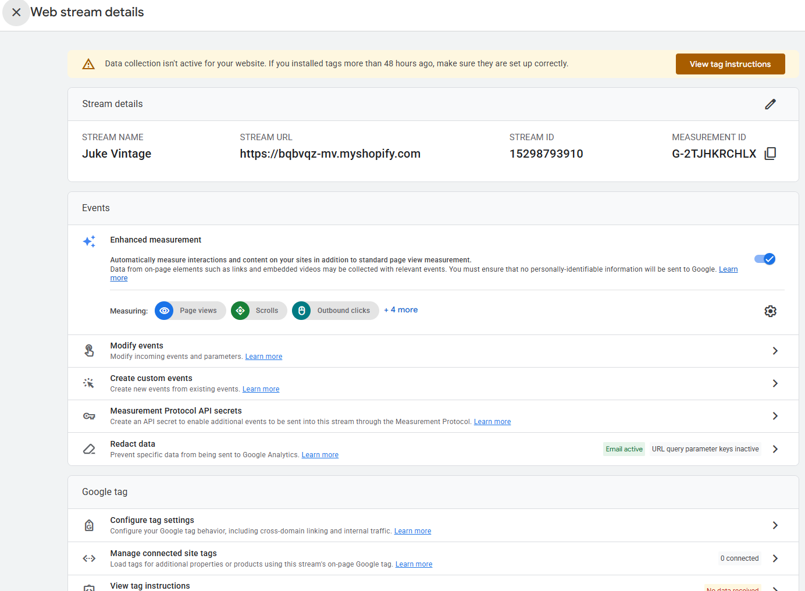
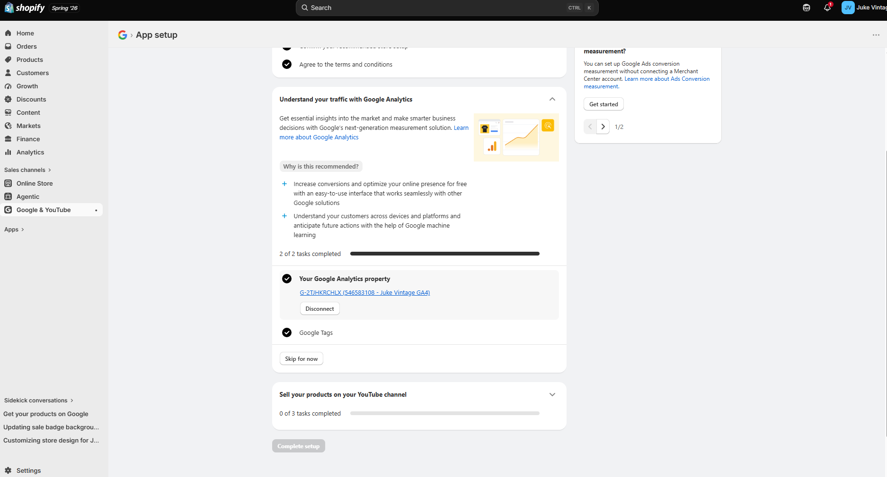
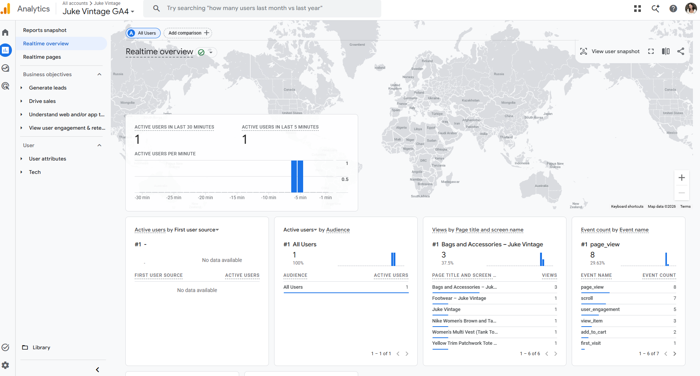
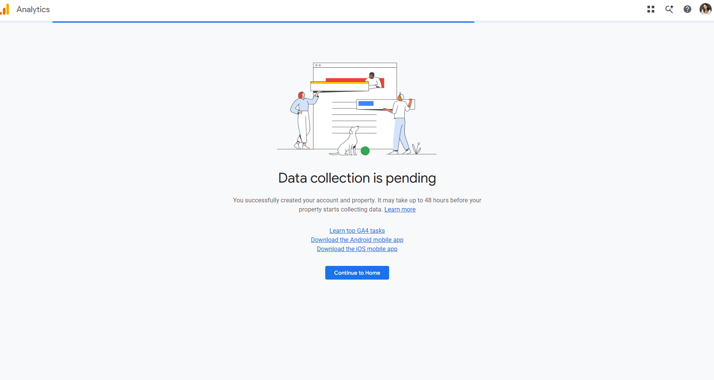

# GA4 Property and Web Stream Evidence

The screenshot below shows the web stream details for the Juke Vintage GA4 property, including the stream URL, stream ID, and measurement ID connected to the Shopify store.

::: {.cert-frame}
{fig-alt="GA4 web stream details showing stream name Juke Vintage, stream URL, stream ID, and measurement ID"}
:::

# Shopify Connection Evidence

The screenshot below shows the Google & YouTube app inside Shopify with the Google Analytics property task marked complete, confirming the Juke Vintage GA4 property is linked to the store.

::: {.cert-frame}
{fig-alt="Shopify App setup screen showing 2 of 2 tasks completed with Juke Vintage GA4 connected as the Google Analytics property"}
:::

# Analytics Evidence

The screenshot below shows the GA4 Realtime overview report picking up live activity on the store, including active users, event counts, and the pages being viewed.

::: {.cert-frame}
{fig-alt="GA4 Realtime overview report showing active users, events by name, and views by page title for Juke Vintage"}
:::

# Technical Issue Documentation

::: {.cert-frame}
{fig-alt="GA4 screen reading Data collection is pending, property created but may take up to 48 hours to start collecting data"}
:::

When I first opened the Google Analytics setup screen inside the Google & YouTube app, it had automatically connected to an unrelated GA4 property tied to a personal blog rather than my Shopify store. I disconnected that property and reconnected the correct one, Juke Vintage GA4, confirming the Measurement ID matched the property I created in GA4 directly. I also initially hit a locked checklist that required completing full store setup steps like removing the store password and confirming a store address, which I resolved by adding a placeholder business address since this is a practice store not processing real transactions.

# CPP Farm Store Analytics Reflection

CPP Farm Store could use GA4 or Shopify analytics to track a wide range of customer behavior that would directly inform how the store operates. Page view and event data, like the view item and add_to_cart events shown in my own GA4 setup, could reveal which produce items or gift bundles get the most interest versus which ones visitors skip past. Traffic source data would show whether customers are finding the store through campus channels, social media, or direct visits, which would help decide where to focus promotion. GA4 could also track how far customers get before dropping off, for example browsing products but never reaching checkout, which would flag friction points like unclear pricing or a confusing pickup process. Realtime and engagement data could additionally help the store understand peak browsing times, like right after class hours, so staff can plan pickup availability or restocking around when demand is actually highest.

::: {.flourish}
❧
:::

# Appendix

GitHub Repository: [github.com/jukedz/assignment7-ga4-shopify](https://github.com/jukedz/assignment7-ga4-shopify)

GitHub Pages: [jukedz.github.io/assignment7-ga4-shopify](https://jukedz.github.io/assignment7-ga4-shopify/)
